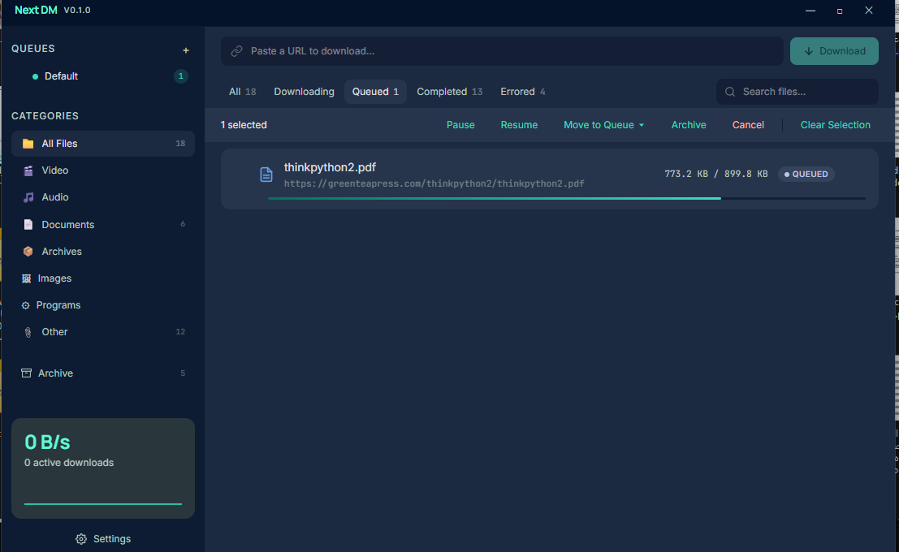
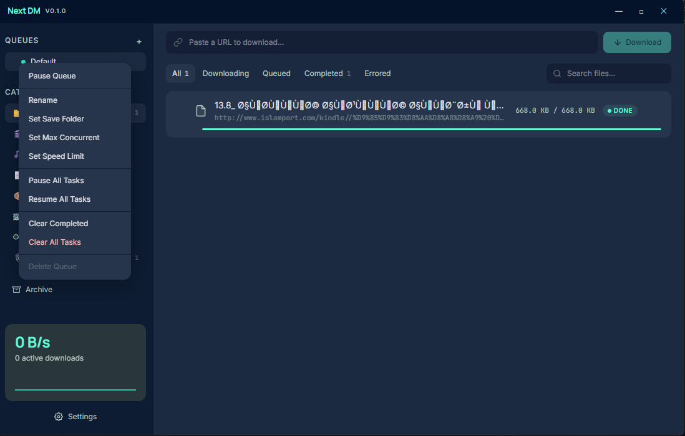
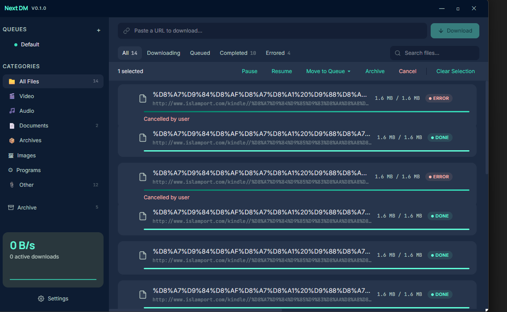
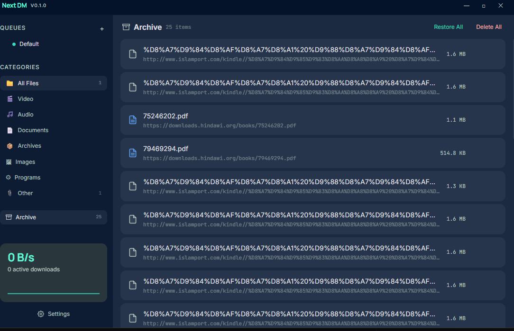
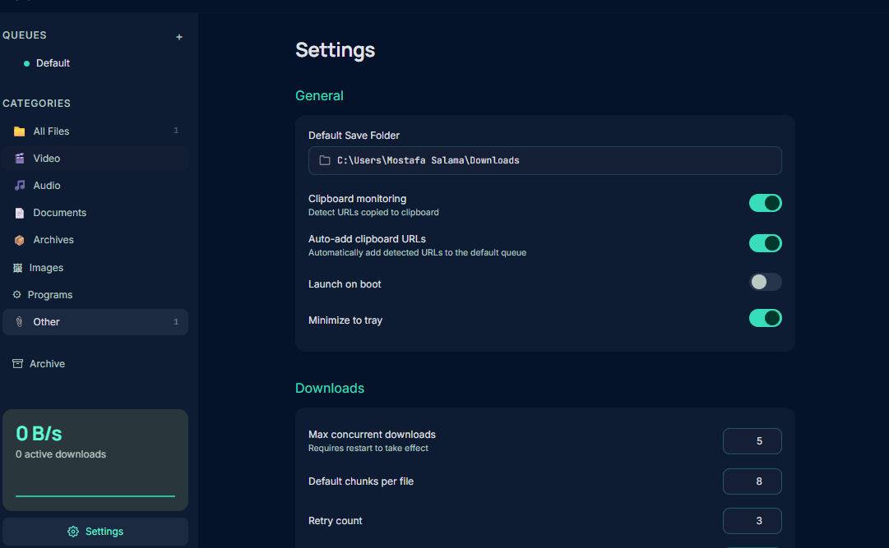
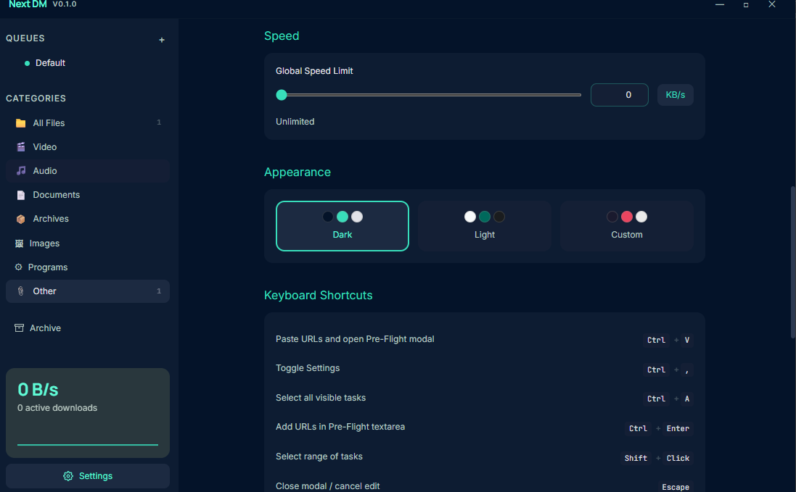

# Next DM

A high-performance desktop download manager built with **Tauri v2**, **React 19**, and **Rust**.

## Screenshots

| Downloads & Queues | Queue Actions |
|---|---|
|  |  |

| Task List & Bulk Actions | Archive |
|---|---|
|  |  |

| Settings — General & Downloads | Settings — Appearance & Shortcuts |
|---|---|
|  |  |

## Features

- **Chunked / multi-part downloads** with resume support via HTTP Range requests
- **Multiple download queues** with per-queue concurrency limits and speed caps
- **Clipboard monitoring** — automatically detects copied URLs and offers to add them
- **Pre-flight modal** — configure filenames, tags, save folder, and queue before starting
- **Batch file naming** — token-based patterns (`{original}`, `{index}`, custom text)
- **Global speed limiter** — token-bucket algorithm keeps bandwidth in check
- **Category filtering** — video, audio, documents, archives, images, programs
- **Status filtering** — downloading, completed, queued, paused, errored
- **Drag-and-drop queue reordering**
- **Archive** — move old downloads out of the main view, restore or delete later
- **Dark / Light / Custom themes** with CSS-variable-based theming
- **Settings persistence** in SQLite
- **Open folder** for completed downloads
- **Unicode support** — proper display of Arabic, CJK, and other non-Latin filenames

## Tech Stack

| Layer            | Technology                                      |
| :--------------- | :---------------------------------------------- |
| Desktop Shell    | Tauri v2 (Rust backend, system WebView)         |
| Frontend         | React 19 + TypeScript + Tailwind CSS v4         |
| State Management | Zustand                                         |
| Backend Engine   | Rust — `tokio` + `reqwest` + `rusqlite`         |
| Database         | SQLite (local, file-based)                      |
| IPC              | Tauri command & event system                    |

## Prerequisites

- **Node.js** >= 18
- **Rust** >= 1.77
- **MSVC Build Tools** (Windows) or equivalent C toolchain

## Getting Started

```bash
# Install frontend dependencies
npm install

# Run in development mode (starts both Vite dev server and Tauri)
npm run tauri dev

# Build for production
npm run tauri build
```

## Project Structure

```
next-dm/
├── src/                    # React frontend
│   ├── components/         # UI components
│   │   ├── layout/         # TitleBar, Sidebar, TaskStage, SpeedHUD
│   │   ├── tasks/          # TaskList, TaskRow, FilterBar, AddUrlBar
│   │   ├── sidebar/        # QueueList, QueueItem, QueueContextMenu
│   │   ├── modals/         # PreFlightModal
│   │   ├── notifications/  # ClipboardToast
│   │   ├── settings/       # SettingsView, SpeedLimiter, ThemeSwitcher
│   │   └── shared/         # PatternInput, TagInput, FolderPicker
│   ├── stores/             # Zustand stores (tasks, queues, settings)
│   ├── hooks/              # Custom React hooks
│   ├── lib/                # Utilities (formatters, file icons, naming)
│   └── styles/             # Global CSS & theme variables
├── src-tauri/              # Rust backend
│   ├── src/
│   │   ├── commands/       # Tauri IPC command handlers
│   │   ├── db/             # SQLite schema, migrations, CRUD
│   │   ├── engine/         # Download engine, worker pool, chunk manager, governor
│   │   └── services/       # Clipboard monitor, event emitter
│   └── migrations/         # SQL migration files
└── package.json
```

## License

MIT
